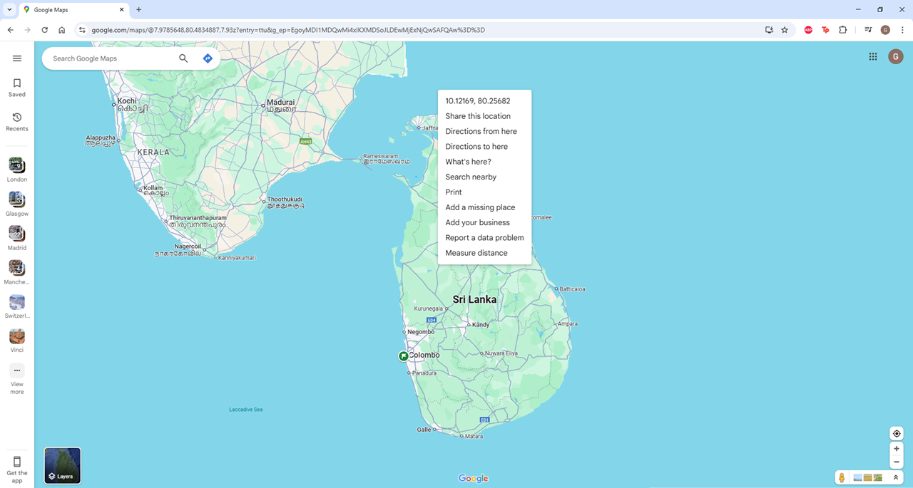

The number in front of the file name indicates the sequence to run the files. If they have the same number, it does not matter which file you run first. Please note that before every R code you need to set your working directory, for instance:

```{r}
# set your working directory
wd <- "C:/Users/gkonstan/OneDrive - Imperial College London/meteo_sri_lanka/"
setwd(wd)
```

## Download the data

The r-files folder includes r-files to download and wrangle meteorological covariates. It can download all the factors available in [ERA-5 land](https://cds.climate.copernicus.eu/datasets/reanalysis-era5-land?tab=download), but there is also a file to download precipitation from the [CHIRPS](https://www.chc.ucsb.edu/data/chirps) dataset. The r-file to download ERA-5 is 01_Download_ERA5.R, whereas for CHIRPS 01_Download_CHIRPS.R.

### ERA-5 download

To download ERA-5, one needs to create an account [here](https://cds.climate.copernicus.eu/).

Once you have successfully **created** and **activated** your account, you need to accept the terms of the dataset you are planning to download. For instance, if you are interested on ERA-5 land, go [here](https://cds.climate.copernicus.eu/datasets/reanalysis-era5-land?tab=download), scroll down to Terms of use and select accept.


On the *01_Download_ERA5.R*, you run the function `wf_set_key()`. Two windows automatically pop up. The one is the web browser and there is another one if R asking for you Personal Access Token. To get the token, visit the ERA-5 website [here](https://cds.climate.copernicus.eu/), go to your name on the top right of the webpage, click and select Your profile. In your profile there is an API Token. You can copy it by clicking the "copy icon" (the one on the right). Once you copy it, past it on the R window that popped up. This will allow you to download data from R.


To define the window of the country you are interested in, go to the function `DownloadMeteorology()`, find the argument area and specify N, W, S, E as a vector. For Sri Lanka you need to specify `area = c(10, 78, 5, 82)`. To find N, W, S, E, you can visit (google maps)[<https://www.google.com/maps>] and **right** click on the map to see the coordinates.

   

ERA-5 has limits on the size and the number of your requests. The code automatically divides the period to monthly intervals to be In line with these requirements.

You need to define a metric:

``` R
{r}
metric <- "surface_pressure"
# c("2m_temperature", "total_precipitation", "2m_dewpoint_temperature", "surface_pressure")
```

and the years:

``` R
{r}
year <- 2017:2024
```

This file also create an *Output* folder in your working directory, in which all the files are stored. Note that the code runs on the parallel environment on a windows machine, and takes approximately 4 hours. If you cannot leave your laptop open this long, you can do one year at the time.

It is likely that with the above specification, you will also encounter issues with download limits. The second part of the code on the file *01_Download_ERA5.R* reads as:

``` R
### SECOND PART OF CODE, RUN IF THE DOWNLOAD LIMITS ARE MET
LIMITS = FALSE
```

If the first part of code fails because of this error, then set \`LIMITS = FALSE\` and run the rest of the code, as many time as needed to have all the files needed.

If you have downloaded all the data, cleaned it and run everything once, you might need to download the files for the updated period. To do so you need to set `update=TRUE` and define the dates to update based on the following format:

``` R
###
# THIS IS IF YOU WANT TO UPDATE THE FILES WITH NEWER DATA
update = TRUE
newdates <- "2025-03-01/2025-03-31"
# OR IF YOU WANT MORE
# newdates <- c("2025-02-01/2025-02-28", "2025-03-01/2025-03-31")
```

### CHIRPS download

To download CHIPRS data, you also need to specify start and end data, and a bounding box. The bounding box is defined in a similar way as in the ERA-5 example for Sri Lanka:

``` R
# Define the start and end date for the data
start_date <- "2017-01-01"
end_date <- "2024-12-31"
dates <- c(start_date, end_date)

# Define the spatial extent for Sri Lanka
lat_range <- seq(5, 10, by = 0.05)   # Latitude range (South to North), adjusting resolution
lon_range <- seq(78, 82, by = 0.05)  # Longitude range (West to East), adjusting resolution
```

The results are also stored in the *Output* folder named *Summary_CHIRPS_rainfall_sum.rds*.

## Data wrangling

The files *02_CalculateHumidity.R* and *02_CleanMeteorology.R* read the **ERA-5 datasets** and extract the daily values.

### Calculate humidity

To calculate relative and specific humidity, you need to also download temperature dew point (`2m_dewpoint_temperature`) and surface pressure (`surface_pressure`) from ERA-5.

Relative Humidity is the ratio of the actual water vapor pressure to the saturation vapor pressure, expressed as a percentage:

$$\text{RH} = \frac{e_d}{e_s}, $$

where $e_d$ is the actual vapor pressure, calculated using the dew point temperature ($T_d$) in $^o$C:

$$e_d = 6.112\times exp\Big(\frac{17.67T_d}{T_d+243.5}\Big),$$ $e_s$ is the saturation vapor pressure, calculated using the air temperature $T$:

$$e_d = 6.112\times exp\Big(\frac{17.67T}{T+243.5}\Big),$$

Specific humidity is the mass of water vapor per unit mass of moist air and is given by:

$$\text{SH} = \frac{0.622e_d}{P - 0.378e_d}, $$

$P$ is the total atmospheric pressure (in hPa) and $e_d$ is the actual vapor pressure as calculated above.

Both of humidities are calculated hourly and then the code retrieves the daily mean.

### Temperature cleaning

The file *02_CleanMeteorology.R* cleans the ERA-5 datasets that do not need to be combined (for instance temperature). This file extracts the hourly varaible and retrieves on of the following statistics: mean, min, max and sum, depending on what we are interested in. For example, if you are interested in the maximum daily temperature then you need to set the following:

``` R
# define the metric
metric <- "2m_temperature"

# define the statistic
stat <- "max"
```

The results from calculating humidity and meteorology cleaning are stored in the Output folder with the names starting with "Summary". For instance if you are calculating the maximum daily temperature the file stored will be named as "Summary_2m_temperature_max.rds".

## Select temporal aggregation

Most of the times, the outcome and exposure data are temporally (and spatially see Shapefile aggregation section) misaligned. An example for this misalignment is when the outcome data is available at the weekly level, whereas the exposure at the daily level. The file *03_CalculateTemporalStat.R* allows you to select the temporal aggregation for the exposure and takes the mean (or sum which could be relevant for rainfall) per temporal unit. For instance if you want to retrieve the weekly maximum temperature, this file will take the daily maximum temperatures, define a week-definition (ise, epi or your own) and calculates the weekly mean of the daily maximum temperatures:

``` R
# read meteorology
# define the metric
metric <- "2m_temperature"

# For "specific_humidity" & "relative_humidity" this needs to be mean, as I calculated the mean
stat <- "max"
# mean, min, max and sum
```

The code defines the function `TemporalStat()`. If you want the mean weekly max isoweek temperatures then set:

``` R
TemporalStat(temporal = "weekly", weekly_stat = "mean", week_type = "isoweek")
```

You can specify other arguments in you function for instance:

``` R
temporal <- "daily", "weekly", "monthly" and "yearly"
weekly_stat <- "mean" or "sum"
week_type <- "epiweek" or "isoweek" or "another"
```

and if you select `week_type <- "another"` you need to provide a path with your csv file that defines the weeks in the following format:

``` R
# wweek yyear       date
# 1     1  2000 1999-12-27
# 2     1  2000 1999-12-28
# 3     1  2000 1999-12-29
# 4     1  2000 1999-12-30
# 5     1  2000 1999-12-31
# 6     1  2000 2000-01-01
```

and then:

``` R
dat_date <- "C:/Users/gkonstan/OneDrive - Imperial College London/meteo_sri_lanka/data/LinkTimeDateClean.csv"

meteo <- TemporalStat(temporal = "weekly", weekly_stat = "mean", week_type = "another", dat_date = dat_date)
```

The results of the code are stored in the *Output* folder under the following format:

```         
SummaryTemporal_2m_temperature_max.rds
```

## Shapefile aggregation

Spatial misalignment between the outcome and the exposure is because the exposure is available at a grid level, whereas the health outcome data, at some administrative level. For instance the temperature from ERA-5 is available at 9km grid resolution (pixels in Kelvin), whereas health data is available at the province level:

<p align="center">
  
</p>

To account for the spatial misalignment between the outcome and the exposure the code applies population weights on the covariates and aggregate per shapefile.

Both population and shapefiles are stored in the *Output* folder.

### Population

The file *04_DownloadPopulation.R* downloads the population from the [WorldPop](https://www.worldpop.org/) at 100m resolution. You need to set the **country** and the **year** of interest:

``` R
# set the country code
iso3 <- "LKA"
# set the year
year <- 2020
```

<p align="center">
  
</p>


I aggregated the population to a grid compatible with the meteorological covariates (i.e., 9km grid)
<p align="center">
  
</p>


### Download the shapefiles

The file *04_DownloadShapefile.R* downloads the shapefile for [GADM](https://gadm.org/). You need to specify the country code:

``` R
country_code <- "LKA" 
```

and the code downloads level 0, 1 and 2:

<p align="center">
  
</p>

### Bring together

To bring together, you will need to run 3 R files: *05_AssignPopWeights.R*, *06_AggregateShapefile.R* and *07_BringTogether.R*

The population is available at 100m grid, whereas the ERA-5 (for instance) at 9km. The file *05_AssignPopWeights.R*, extract the values of the coarses population raster (9km grid) on the centroids of the 9km ERA-5 grid (for instance). 

<p align="center">
  
</p>


The file *06_AggregateShapefile.R* takes the results of the *05_AssignPopWeights.R,* which is for example temperature and population sums at 9km (ERA-5), and overlays the grid to the selected shapefile:

<p align="center">
  
</p>

and then the code calculates the population weighted mean.

$$
x_i = \frac{\sum_{j\sim i}w_jx_j}{\sum_{j\sim i}w_j}
$$

where $i$ is the spatial unit and $j\sim i$ are the points of the $j$-th grid cell that fall in to the $i$-th region.

Note that this procedure might now work when the shapefile is more refined:

<p align="center">
  
</p>

In this example, there are regions which do not overlap with the coarse grid. In this case, the code checks if there are NAs and imputes them with the nearest exposure value.

The file *07_BringTogether.R*, brings together the different exposures ready to be linked with the health outcome data. The format is the following:

``` R
fin <- readRDS(file = "Output/PopulationWeightedMeteorology_Level1.rds")
head(fin)
```
